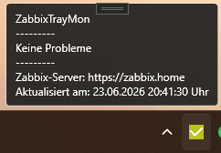
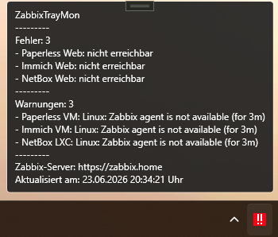
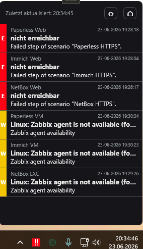
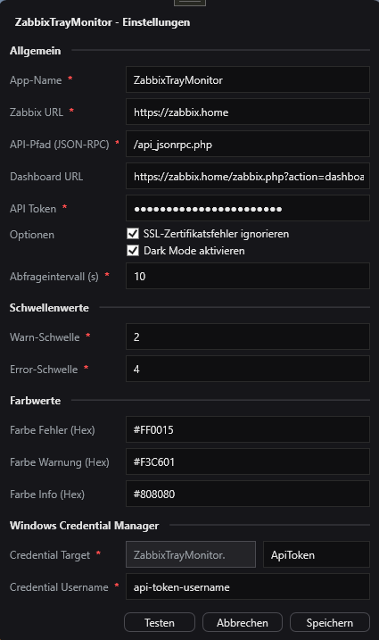

# Zabbix Tray Monitor

Kleiner Windows Tray Client fuer Zabbix.

Die Anwendung laeuft im Windows System Tray und zeigt den aktuellen Zabbix-Status ueber ein farbiges Tray-Icon, einen kompakten Tooltip und ein kleines Problemfenster an.

Je nach Zustand zeigt das Tray-Icon direkt an, ob alles fehlerfrei ist, Warnungen vorhanden sind oder Fehler vorliegen. Tooltip und Problemfenster listen die aktuellen relevanten Zabbix-Probleme auf.

## Ziel

Zabbix Tray Monitor soll schnell sichtbar machen, ob aktuell relevante Zabbix-Probleme vorhanden sind, ohne dass dauerhaft das Zabbix-Dashboard im Browser geoeffnet sein muss.

## Download

[](https://github.com/Darano94/ZabbixTrayMonitor/releases)

## Screenshots

### Tray Tooltip ohne Probleme



### Tray Tooltip mit Problemen



### Problemfenster



### Einstellungen



## Basisfunktionen

* Windows Tray Icon mit farbiger Statusanzeige
* automatische Abfrage der aktuellen Zabbix-Probleme
* kompakter Tooltip mit Fehlern und Warnungen
* Tooltip zeigt maximal 10 Eintraege und markiert weitere Eintraege mit `[...]`
* Problemfenster mit aktueller Problemliste inklusive Hostnamen
* Problemfenster zeigt Host, wichtigste Meldung, Detailinformation und Statusfarbe
* direkte Verlinkung zum Zabbix Dashboard
* konfigurierbares Abfrageintervall
* konfigurierbare Severity-Schwellenwerte
* konfigurierbare Statusfarben
* Dark Mode / Light Mode
* Einstellungen ueber eigenes Fenster
* API Token wird im Windows Credential Manager gespeichert

## Config

Die Konfiguration liegt unter:

```text
%AppData%\ZabbixTrayMonitor\config.json
```

Beispiel:

```json
{
  "ZabbixUrl": "https://zabbix.home",
  "ZabbixDashboardUrl": "https://zabbix.home/zabbix.php?action=dashboard.view&dashboardid=407",
  "ZabbixApiEndpoint": "/api_jsonrpc.php",
  "PollIntervalSeconds": 60,
  "IgnoreCertificateErrors": true,
  "UseDarkMode": true,
  "AppName": "ZabbixTrayMonitor",
  "WarningSeverityThreshold": 2,
  "ErrorSeverityThreshold": 4,
  "StatusColorError": "#FF0015",
  "StatusColorWarning": "#F3C601",
  "StatusColorInfo": "#808080",
  "CredentialTargetSuffix": "ApiToken",
  "CredentialUsername": "api-token"
}
```

Der API Token wird nicht in der `config.json` gespeichert.

Der Token wird im Windows Credential Manager gespeichert. Das Credential Target wird aus `AppName` und `CredentialTargetSuffix` gebaut.

Beispiel:

```text
ZabbixTrayMonitor.ApiToken
```


Der Token braucht die benötigten Reche auf die folgenden Zabbix-Endpunkte:
- problem.get
- event.get
- trigger.get
- apiinfo.version

## Severity Mapping

Die Zabbix API liefert Severity-Werte zwischen 0 und 5:

```text
0 = Not classified
1 = Information
2 = Warning
3 = Average
4 = High
5 = Disaster
```

`WarningSeverityThreshold` bestimmt, ab welchem Severity-Wert ein Problem als Warnung gewertet wird.

`ErrorSeverityThreshold` bestimmt, ab welchem Severity-Wert ein Problem als Fehler gewertet wird.

Standardmaessig:

```text
Severity 0-1 -> ignoriert
Severity 2-3 -> Warnung
Severity 4-5 -> Fehler
```

## Tray Icon Status

```text
OK       -> keine relevanten Probleme
Warnung  -> mindestens eine Warnung
Fehler   -> mindestens ein Fehler oder API-/Konfigurationsfehler
Unknown  -> Initialzustand vor der ersten Abfrage
```

## Tooltip

Der Tooltip ist bewusst kompakt gehalten.

Angezeigt werden:

```text
Host: wichtigste Meldung
```

Wenn Fehler und Warnungen gleichzeitig vorhanden sind, werden maximal 5 Fehler und 5 Warnungen angezeigt.

Wenn nur Fehler oder nur Warnungen vorhanden sind, werden maximal 10 Eintraege angezeigt.

Gibt es mehr Eintraege als angezeigt werden, erscheint am Ende der jeweiligen Sektion:

```text
- [...]
```

## Problemfenster

Das Problemfenster zeigt die aktuellen Zabbix-Probleme in einer kompakten Liste.

Pro Eintrag werden angezeigt:

```text
Host
wichtigste Meldung
Detailinformation / ueberwachtes Objekt
```

Links am Eintrag zeigt ein farbiger Balken inklusive Buchstabe den Status:

```text
E = Error
W = Warning
I = Info
```

## API

Die Anwendung nutzt die Zabbix JSON-RPC API.

Standard API-Pfad:

```text
/api_jsonrpc.php
```

Authentifizierung erfolgt ueber Bearer Token.

Fuer die Problemliste werden die aktuellen Probleme abgefragt und mit weiteren Informationen wie Hostnamen und Trigger-/Item-Informationen angereichert.

Genutzte Zabbix API-Methoden:

```text
problem.get
event.get
trigger.get
apiinfo.version
```

## Bibliotheken

### Hardcodet.NotifyIcon.Wpf

WPF-Unterstuetzung fuer Windows System Tray Icons.

### CredentialManagement

Zugriff auf den Windows Credential Manager.

## Todo

* Probleme acknowledgen

## Bugs

Keine bekannten Bugs fuer V1.1.
