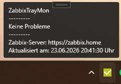
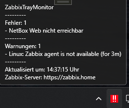
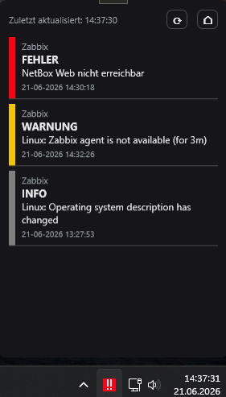
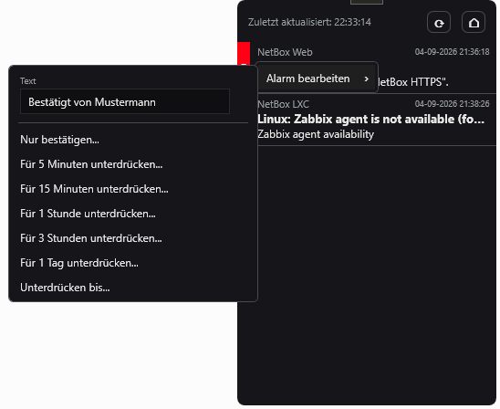
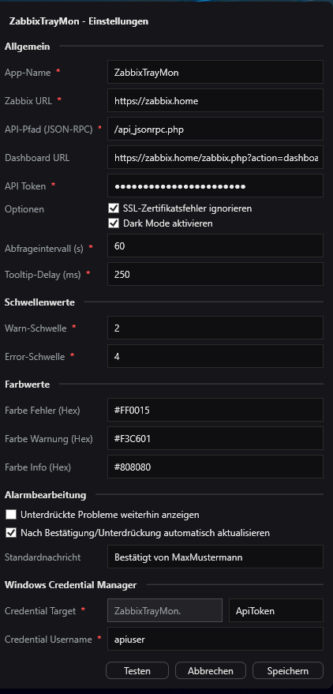

# Zabbix Tray Monitor

Kleiner Windows Tray Client für Zabbix.

Die Anwendung läuft im Windows System Tray und zeigt den aktuellen Zabbix-Status über ein farbiges Tray-Icon, einen Tooltip und ein kleines Problemfenster an.

Je nach Zustand zeigt das Tray-Icon direkt an, ob alles fehlerfrei ist, Warnungen vorhanden sind oder Fehler vorliegen. Tooltip und Problemfenster listen die aktuellen relevanten Zabbix-Probleme auf.

## Funktionen

- Tray-Status für OK, Warnung, Fehler und unbekannten Zustand
- Automatische Aktualisierung über konfigurierbares Abfrageintervall
- Kompakter Tooltip mit den wichtigsten aktuellen Problemen
- Einstellbare Verzögerung bis zum Öffnen des Tray-Tooltips
- Problemfenster mit Host, Zeit, Meldung und überwachtem Objekt
- Dark- und Light-Mode
- API-Token im Windows Credential Manager
- Alarmbearbeitung direkt im Problemfenster:
  - Nur bestätigen
  - Für 5 Minuten unterdrücken
  - Für 15 Minuten unterdrücken
  - Für 1 Stunde unterdrücken
  - Für 3 Stunden unterdrücken
  - Für 1 Tag unterdrücken
  - Unterdrücken bis zu einem frei wählbaren Datum/Zeitpunkt
- Konfigurierbare Standardnachricht für Bestätigungen/Unterdrückungen
- Nachricht kann pro Aktion direkt im Kontextmenü überschrieben werden
- Unterdrückte Probleme können wahlweise weiterhin angezeigt werden
- Optionaler automatischer Refresh nach einer Alarmaktion inklusive verzögertem Folge-Refresh

## Download

[](https://github.com/Darano94/ZabbixTrayMonitor/releases)

## Installation

1. Aktuelle Release-ZIP herunterladen und entpacken.
2. `ZabbixTrayMonitor.exe` starten.
3. Beim ersten Start die **Einstellungen** öffnen.
4. **Zabbix URL** und **API Token** eintragen.
5. Mit **Testen** die Verbindung prüfen und anschließend **Speichern**.

## Screenshots

### Tray Tooltip ohne Probleme



### Tray Tooltip mit Problemen



### Problemfenster



### Alarmbearbeitung



### Einstellungen



## Config

Die Konfiguration liegt unter:

```text
%AppData%\ZabbixTrayMonitor\config.json
```

Beispiel:

```json
{
  "ZabbixUrl": "https://zabbix.home",
  "ZabbixDashboardUrl": "https://zabbix.home/zabbix.php?action=dashboard.view&dashboardid=407",
  "ZabbixApiEndpoint": "/api_jsonrpc.php",
  "PollIntervalSeconds": 60,
  "TrayToolTipDelayMilliseconds": 250,
  "IgnoreCertificateErrors": true,
  "UseDarkMode": true,
  "ShowSuppressedProblems": false,
  "RefreshAfterProblemAction": true,
  "AcknowledgeMessage": "Bestätigt von max.mustermann",
  "AppName": "ZabbixTrayMonitor",
  "WarningSeverityThreshold": 2,
  "ErrorSeverityThreshold": 4,
  "StatusColorError": "#FF0015",
  "StatusColorWarning": "#F3C601",
  "StatusColorInfo": "#808080",
  "CredentialTargetSuffix": "ApiToken",
  "CredentialUsername": "api-token"
}
```

## Severity Mapping

Die Zabbix API liefert Severity-Werte zwischen 0 und 5:

```text
0 = Not classified
1 = Information
2 = Warning
3 = Average
4 = High
5 = Disaster
```

`WarningSeverityThreshold` bestimmt, ab welchem Severity-Wert ein Problem als Warnung gewertet wird.

`ErrorSeverityThreshold` bestimmt, ab welchem Severity-Wert ein Problem als Fehler gewertet wird.

Standardmäßig:

```text
Severity 0-1 -> ignoriert
Severity 2-3 -> Warnung
Severity 4-5 -> Fehler
```

## Alarmbearbeitung

Ein Rechtsklick auf ein Problem öffnet das Menü `Alarm bearbeiten`.

`Nur bestätigen...` führt in Zabbix `event.acknowledge` mit Bestätigung und Nachricht aus.

Die zeitlich begrenzten Unterdrückungen bestätigen das Event, fügen die Nachricht hinzu und setzen eine Unterdrückung bis zum gewählten Zeitpunkt.

Wenn `ShowSuppressedProblems` auf `false` steht, werden unterdrückte Probleme aus Tray-Status, Tooltip und Problemfenster ausgeblendet.

## API

Die Anwendung nutzt die Zabbix JSON-RPC API.

Standard API-Pfad:

```text
/api_jsonrpc.php
```

Authentifizierung erfolgt über Bearer Token.

Für die Problemliste werden die aktuellen Probleme gesammelt abgefragt und mit Hostnamen sowie Trigger-/Item-Informationen angereichert. Es wird nicht pro Problem ein einzelner API-Request ausgeführt.

Genutzte Zabbix API-Methoden:

```text
problem.get
event.get
trigger.get
event.acknowledge
apiinfo.version
```

Der Benutzer hinter dem API-Token muss über die benötigten Zabbix-Berechtigungen verfügen. Für die Alarmbearbeitung muss das Bestätigen bzw. Unterdrücken der betreffenden Events erlaubt sein.

## Bibliotheken

### Hardcodet.NotifyIcon.Wpf

WPF-Unterstützung für Windows System Tray Icons.

### CredentialManagement

Zugriff auf den Windows Credential Manager.
